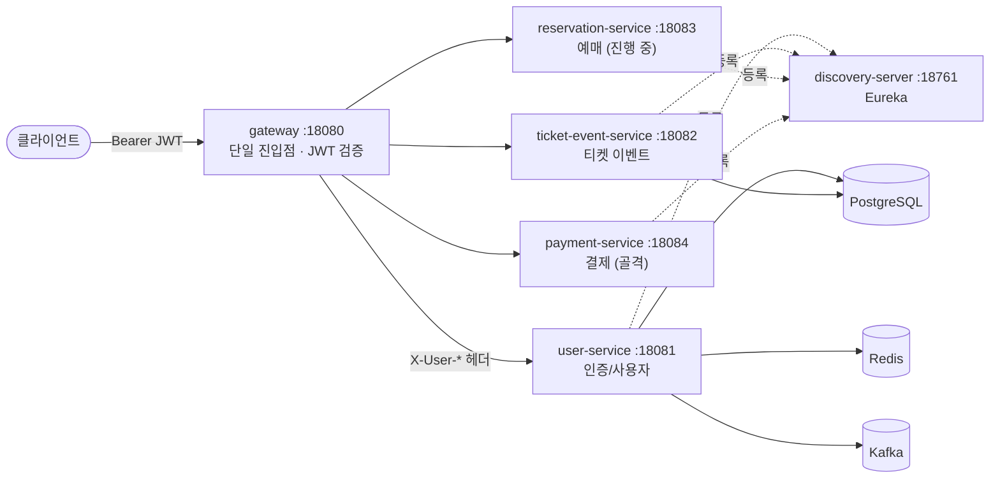

# 🎟️ ticket-server 문서

티켓 예매 서버의 **설계·구현 문서**입니다. 코드를 읽기 전에 "무엇이, 어디에, 왜 있는지" 를
빠르게 파악하는 용도입니다.

> [!note] 코드가 정답입니다
> 이 문서는 코드를 따라가며 갱신하는 참조 자료입니다. 코드와 어긋난 부분을 발견하면 **코드를 기준**으로
> 삼고 이 문서를 고쳐 주세요. 빌드·실행 방법과 코딩 규약은 저장소 루트 [`CLAUDE.md`](../CLAUDE.md) 가 정본입니다.

---

## 📁 문서 한눈에 보기

| 문서 | 내용 |
|------|------|
| [architecture.md](./architecture.md) | 시스템 전체 구조 — MSA 구성, 게이트웨이 인증 흐름, 헥사고날+CQRS 규칙, 공통 모듈, 인프라 |
| [user-service.md](./user-service.md) | 사용자/인증 도메인 — 회원가입·로그인(JWT 발급)·비밀번호 재설정·내 정보 |
| [ticket-event-service.md](./ticket-event-service.md) | 티켓 이벤트 도메인 — 공연/경기 CRUD·셋업 워크플로우·좌석 상태·잔여석 조회 |
| [reservation-service.md](./reservation-service.md) | 예매 도메인 — 좌석 hold/sell/환불 (진행 중) |
| [payment-service.md](./payment-service.md) | 결제 도메인 — PG 연동 (골격만) |

모든 서비스 문서는 **동일한 목차**를 따릅니다: ① 한눈에 보기 → ② 도메인 모델 → ③ 유스케이스 →
④ API → ⑤ 영속성·인프라 → ⑥ 주요 흐름.

---

## 🗺️ 시스템 한눈에 보기

- **MSA 멀티모듈** (Spring Cloud: Eureka + Gateway). 외부에는 **게이트웨이(18080)** 만 노출됩니다.
- 인증은 **user-service 가 JWT 발급**, **gateway 가 검증**하는 단일 지점 구조입니다. 자세한 흐름은
  [architecture.md](./architecture.md) 참고.
- 각 비즈니스 서비스 내부는 **헥사고날(Ports & Adapters) + CQRS** 로 동일하게 구성됩니다.

---

## 📊 서비스 구현 현황

| 서비스 | 모듈 | 포트 | 상태 | 핵심 기능 |
|--------|------|:----:|:----:|----------|
| 사용자/인증 | `user-service` | 18081 | ✅ 구현됨 | 회원가입 · 로그인(JWT) · 비밀번호 재설정 · 내 정보 |
| 티켓 이벤트 | `ticket-event-service` | 18082 | ✅ 구현됨 | 이벤트 CRUD · 상태전이 · 셋업(구역→좌석→완료) · 잔여석 집계 |
| 예매 | `reservation-service` | 18083 | 🟡 도메인만 | 도메인 모델·상태(enum) 정의됨, 애플리케이션/인프라 미구현 |
| 결제 | `payment-service` | 18084 | ⬜ 골격만 | 헥사고날 패키지 골격만 존재, 비즈니스 로직 전부 TODO |
| 게이트웨이 | `gateway` | 18080 | ✅ 구현됨 | JWT 검증 · `X-User-*` 신원 헤더 주입 · 라우팅 |
| 디스커버리 | `discovery-server` | 18761 | ✅ 구현됨 | 단일 노드 Eureka |
| 공통 | `common` | — | ✅ 구현됨 | JWT 검증기 · 공통 예외 핸들러 · OpenAPI 설정 |

---

## 🧭 어디서부터 읽을까

- **시스템이 처음이라면** → [architecture.md](./architecture.md) (전체 그림 + 인증)
- **API 를 호출하고 싶다면** → 각 서비스 문서의 *④ API 레퍼런스*
- **도메인 규칙이 궁금하다면** → 각 서비스 문서의 *② 도메인 모델* (상태 머신 다이어그램 포함)
- **빌드·실행** → [`CLAUDE.md`](../CLAUDE.md) (모듈 구조·명령·기동 순서)

---

## ✍️ 문서 작성 규칙

서비스가 추가되면 `docs/{service}.md` **한 파일**을 만들고, 기존 서비스 문서와 **같은 목차**를 따릅니다.
파일을 잘게 쪼개지 말고(과거의 파편화된 레이어별 디렉토리 구조는 폐기됨), 한 서비스는 한 문서에서
위에서 아래로 읽히게 합니다. 시스템 전반(게이트웨이·인증·인프라) 변경은 [architecture.md](./architecture.md) 에 반영합니다.
