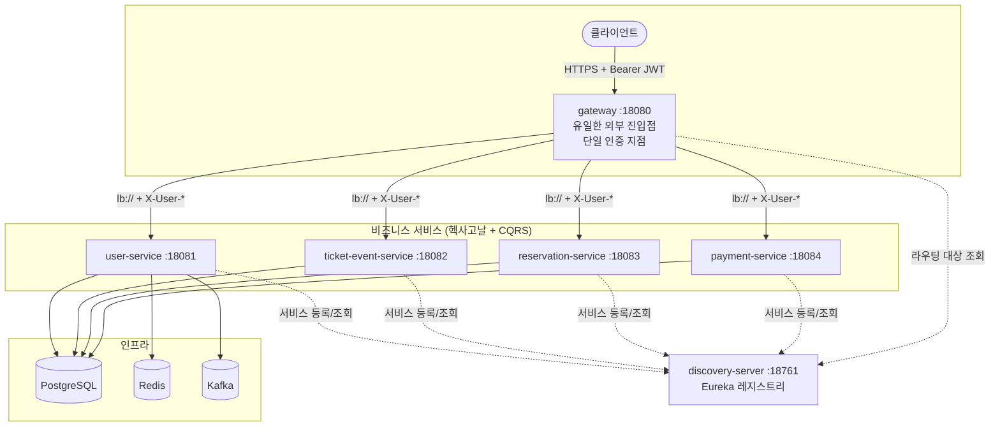
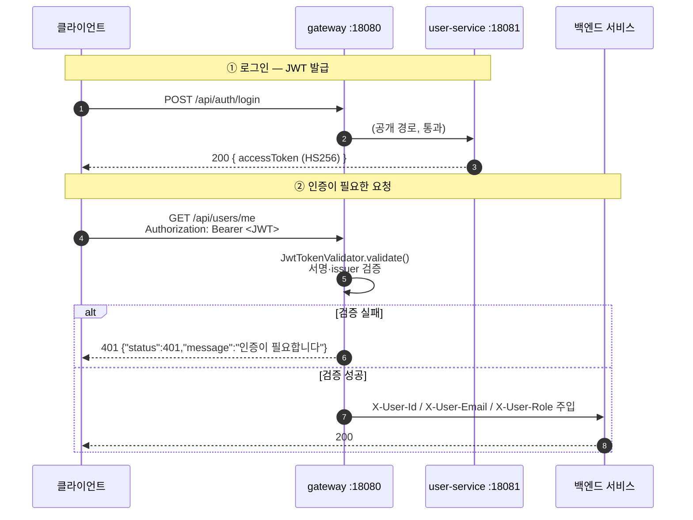
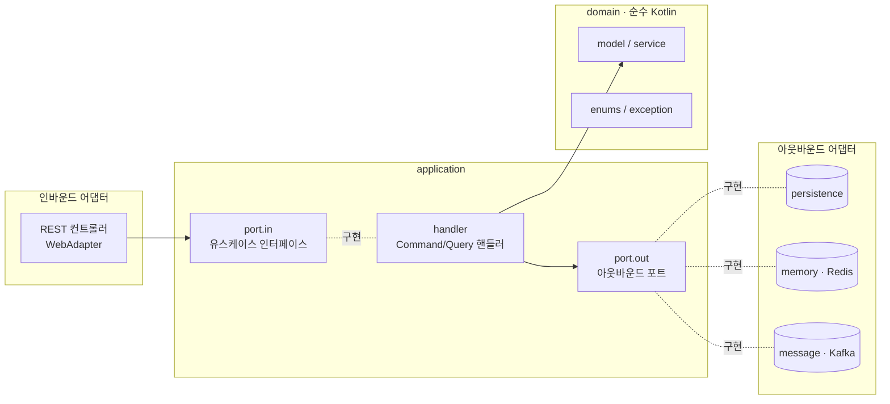

# 🏛️ 시스템 아키텍처

ticket-server 의 전체 구조와, 모든 서비스가 공유하는 규칙을 설명합니다. 개별 도메인 상세는 각
서비스 문서를, 빌드·실행·기동 순서는 [`CLAUDE.md`](../CLAUDE.md) 를 참고하세요.

---

## 1. 큰 그림 — MSA 멀티모듈



| 모듈 | 포트 | 역할 |
|------|:----:|------|
| `discovery-server` | 18761 | Eureka 서버 (단일 노드, 자기 등록 안 함) |
| `gateway` | 18080 | Spring Cloud Gateway. **유일한 외부 진입점 + 단일 인증 지점** |
| `user-service` | 18081 | 사용자/인증 (회원가입·로그인·비밀번호 재설정·내 정보) |
| `ticket-event-service` | 18082 | 티켓 이벤트 CRUD·상태전이·조회 |
| `reservation-service` | 18083 | 예매 (진행 중) |
| `payment-service` | 18084 | 결제 (진행 중) |
| `shared` | — | 실행 불가 `java-library`. JWT 검증기·공통 예외 핸들러·OpenAPI 설정 공유 |

> 모든 모듈은 같은 베이스 패키지 `com.gijun.ticketserver` 를 공유합니다(모듈이 달라도 동일).
> 빌드 루트는 저장소 루트가 아니라 **`ticket-server-be/`** 입니다.

---

## 2. 인증 아키텍처 (핵심)

JWT **발급은 user-service**, **검증은 gateway** 가 담당합니다. 양쪽은 `shared` 의
`JwtTokenValidator` 와 동일한 `jwt.secret` / `jwt.issuer` 를 공유합니다.



### 게이트웨이의 보장

1. `JwtAuthGatewayFilter` 가 **최고 우선순위(HIGHEST_PRECEDENCE)** 로 모든 요청의
   `Authorization: Bearer` 를 검증합니다.
2. 검증 성공 시 신원을 **`X-User-Id` / `X-User-Email` / `X-User-Role` 헤더로 백엔드에 전달**합니다.
3. 클라이언트가 보낸 `X-User-*` 헤더는 **신뢰하지 않습니다** — `IdentityHeaderRequest` 가 감싸서
   게이트웨이가 세팅한 값만 노출하고, 위조 헤더는 제거합니다(공개 경로에서도 제거).
4. **공개 경로**는 인증 없이 통과합니다:
   - `PUBLIC_PATHS` : `/api/auth/**`, `/actuator/**`
   - `PUBLIC_GET_PATHS` : `/api/ticket-events/**` 는 **GET 만** 비로그인 허용(공연 목록·상세·구역·좌석 조회).
     생성/수정 등 변경 요청은 인증이 필요합니다.

### 신원 헤더 계약 (X-User-\*)

| 헤더 | 출처(JWT 클레임) | 예시 |
|------|------------------|------|
| `X-User-Id` | `sub` | `42` |
| `X-User-Email` | `email` | `user@example.com` |
| `X-User-Role` | `role` | `USER` / `ADMIN` |

- **`ticket-event-service` 는 보안 의존성이 없습니다.** 게이트웨이가 보장한 `X-User-*` 헤더를 신뢰합니다.
- **`user-service` 는 자체 `SecurityConfig` + `JwtAuthenticationFilter` 도 가집니다.** 게이트웨이를
  우회한 직접 호출 시에도 `Authorization` 토큰을 직접 검증합니다. (상세는 [user-service.md](./user-service.md))

> [!warning] JWT 설정 변경 시
> `jwt.secret` / `jwt.issuer` 를 바꿀 때는 **gateway 와 user-service 의 설정을 함께** 수정해야 합니다.
> 두 서비스가 같은 비밀키/발급자를 공유하지 않으면 발급된 토큰을 검증할 수 없습니다.

### JWT 토큰 사양

| 항목 | 값 |
|------|-----|
| 알고리즘 | HS256 (HMAC-SHA256), 비밀키 ≥ 32 byte |
| `iss` | `jwt.issuer` (기본 `ticket-server`) |
| `sub` | 사용자 ID |
| 커스텀 클레임 | `email`, `role` |
| 만료 | `jwt.access-token-expiration-millis` (기본 1시간) |
| Refresh Token | 없음 (Stateless, 만료 시 재로그인) |

---

## 3. 서비스 내부 구조 — 헥사고날 + CQRS

각 비즈니스 서비스는 동일한 레이어 규칙을 따릅니다. 의존성 화살표는 항상 **바깥 → 안쪽**.
`domain` / `application` 은 `infrastructure` 를 모릅니다.



### 패키지 레이아웃

```
domain/                  순수 Kotlin (프레임워크 의존 X)
  model / service / enums / exception(sealed)
application.<도메인>/
  port.in/               유스케이스 인터페이스 (command / query 분리)
  port.out/              영속성 / memory(Redis) / message(Kafka) / token 포트
  dto/                   Commands / Queries / Results
  handler/               유스케이스 구현 = CommandHandler / QueryHandler
infrastructure/
  adapter.in.<도메인>.web/    REST 컨트롤러 + 요청/응답 DTO
  adapter.out.<도메인>/       포트 구현체 (persistence / memory / message / token)
  config/                     예외 핸들러, security 등
```

### 레이어 규칙

- **CQRS**: 명령(Command)은 `@Transactional`, 조회(Query)는 `@Transactional(readOnly = true)`.
  핸들러도 Command/Query 로 분리합니다.
- **유스케이스 = 1 인터페이스 1 함수**. 한 핸들러가 같은 그룹의 여러 단일함수 인터페이스를 구현하고,
  인터페이스는 `<도메인>CommandUseCases.kt` / `<도메인>QueryUseCases.kt` 로 모읍니다.
- 아웃바운드 포트 구현체는 모두 `infrastructure/adapter/out/<도메인>/<관심사>/` 아래 둡니다.
- **도메인 모델은 불변(immutable)** — 상태 전이는 새 인스턴스를 반환하는 메서드(`open()`, `hold()` 등)로
  표현하고, 불변식은 `init`/`require` 로 강제합니다.

---

## 4. 공통 모듈 (`shared`)

실행 불가능한 `java-library` 로, 모든 서비스가 의존하는 공유 코드를 담습니다.

| 클래스 | 역할 |
|--------|------|
| `JwtTokenValidator` | JWT 서명·issuer 검증 후 `JwtClaims(userId, email, role)` 반환. 실패 시 `null` |
| `JwtProperties` | `@ConfigurationProperties(prefix="jwt")` — `secret` / `accessTokenExpirationMillis` / `issuer` |
| `CommonExceptionHandler` | `MethodArgumentNotValidException`(검증 실패)·`IllegalArgumentException`(불변식 위반) → **400** |
| `ApiErrorResponse` | 공통 에러 응답 `{ status, message, fieldErrors }` |
| `OpenApiConfig` | OpenAPI 3 스펙 + `bearerAuth`(Bearer JWT) 보안 스킴 |

> `role` 은 String 으로 다룹니다(`shared` 이 특정 도메인 enum 에 의존하지 않도록).

### 에러 응답 형식 (전 서비스 공통)

```json
{
  "status": 400,
  "message": "올바른 이메일 형식이 아닙니다",
  "fieldErrors": { "email": "must be a well-formed email address" }
}
```

`fieldErrors` 는 Bean Validation(`@Valid`) 실패 시에만 채워지고, 그 외에는 빈 맵입니다.

---

## 5. 인프라 & 설정

### 부가 인프라

| 인프라 | 용도 | 사용 서비스 |
|--------|------|-------------|
| PostgreSQL | 주 영속성 (로컬 dev 는 H2 PostgreSQL 호환 모드) | user, ticket-event, (reservation·payment 예정) |
| Redis | 휘발성 토큰 저장 (비밀번호 재설정 토큰 TTL) | user |
| Kafka | 이벤트 발행 (가입·비밀번호 재설정 요청) | user |

로컬 인프라는 저장소 루트 `infra/compose.yaml` 로 띄웁니다(PostgreSQL·Redis·Elasticsearch·Kafka).

### 환경변수 주입

datasource/redis/kafka/jwt 설정은 **환경변수로 주입**하며 기본값은 로컬 dev(`localhost`)입니다.
**실제 자격증명은 절대 커밋하지 않습니다**(public 저장소).

| 환경변수 | 기본값(로컬) |
|----------|-------------|
| `DB_URL` / `DB_USERNAME` / `DB_PASSWORD` | `jdbc:postgresql://localhost:5432/ticketserver` / `ticketserver` / `ticketserver` |
| `REDIS_HOST` / `REDIS_PORT` / `REDIS_PASSWORD` | `localhost` / `6379` / — |
| `KAFKA_BOOTSTRAP_SERVERS` | `localhost:9092` |
| `JWT_SECRET` / `JWT_ISSUER` | (개발 기본키) / `ticket-server` |

배포는 `ticket-server-be/deploy/.env`(미추적, `.env.example` 참고)로 주입합니다. 빌드·기동 순서 등
운영 방법은 [`CLAUDE.md`](../CLAUDE.md) 와 `ticket-server-be/deploy/README.md` 를 참고하세요.

---

## 6. 기술 스택

- **언어/런타임**: Kotlin 2.3.20 / JDK 25 (Gradle toolchain)
- **프레임워크**: Spring Boot 4.0.6 (Spring Framework 7, Spring Security 7) / Spring Cloud 2025.1.x
- **영속성**: JPA(Hibernate) + PostgreSQL
- **빌드**: Gradle (Version Catalog `gradle/libs.versions.toml`), 루트 `subprojects {}` 가 공통 설정 적용
- **테스트**: JUnit5 + Kotest + MockK + Testcontainers (테스트는 H2 사용)
