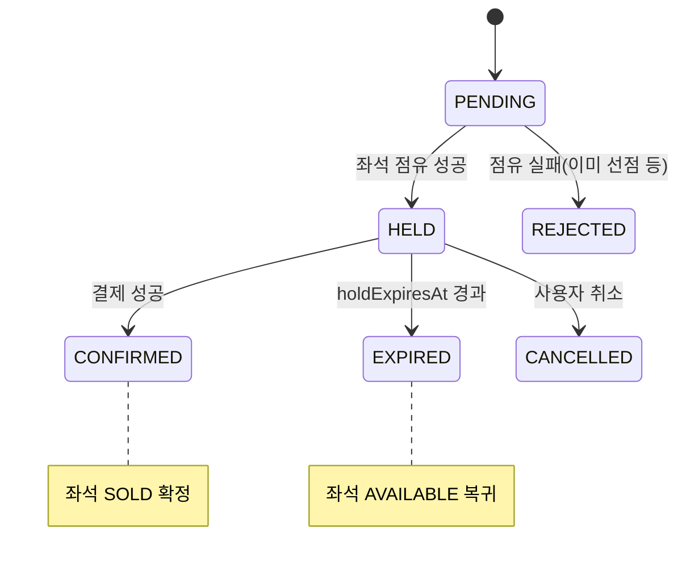

# 🪑 reservation-service — 예매

> `reservation-service` · 포트 **18083** · 상태 **🟡 도메인만 구현**
> 좌석을 잡고(hold) 결제 확정/만료/취소까지 잇는 예매 도메인. **현재 도메인 모델·상태만 정의**돼 있고
> 애플리케이션·인프라 레이어는 비어 있습니다.

> [!warning] 구현 현황 (코드 기준)
> - ✅ **도메인**: `ReservationModel`, `ReservationStatus` 정의됨
> - 🟡 **애플리케이션**: `CreateReservationCommand` DTO 존재. 유스케이스 인터페이스는 `Unit` 타입 **스텁**
> - ⬜ **인프라**: 컨트롤러·엔티티·리포지토리·어댑터 **없음**
>
> 아래 *2. 도메인 모델* 만 코드를 반영한 확정 내용이고, *4~5* 는 설계 방향(예정)입니다.

---

## 1. 한눈에 보기

| 항목 | 내용 |
|------|------|
| 책임 | 좌석 점유(HELD) → 결제 연동 → 확정(CONFIRMED)/만료(EXPIRED)/취소 |
| 연계 | `ticket-event-service`(좌석 상태 `hold/sell/cancel`), `payment-service`(결제) |
| 설정 | PostgreSQL, Eureka 등록 (`application.yml`: port 18083, `ddl-auto: update`) |

예매는 ticket-event 의 **좌석 상태 머신**과 맞물립니다: 예매 생성 시 좌석을 `HELD` 로,
결제 성공 시 `SOLD` 로, 만료/취소 시 `AVAILABLE` 로 되돌립니다.
([ticket-event 좌석 상태](./ticket-event-service.md#좌석-상태-seatstatus) 참고)

---

## 2. 도메인 모델 ✅

### ReservationModel

| 필드 | 타입 | 비고 |
|------|------|------|
| `id` | `Long?` | |
| `reservationCode` | `String` | not blank, 예매 식별 코드 |
| `transactionId` | `String` | not blank, 트랜잭션 추적 ID |
| `userId` | `Long` | 예매자 |
| `ticketEventId` | `Long` | 대상 이벤트 |
| `seatId` | `Long` | 대상 좌석 |
| `status` | `ReservationStatus` | 기본 `PENDING` |
| `price` | `Long` | ≥ 0 |
| `holdExpiresAt` | `Instant` | 점유 만료 시각 |
| `paymentId` | `String?` | 결제 식별자 |
| `confirmedAt` | `Instant?` | 확정 시각 |
| `failureReason` | `String?` | 실패 사유 |
| `createdAt` / `updatedAt` | `Instant?` | |

판단 메서드: `isPending()`, `isHeld()`, `isExpired(at)`.

### ReservationStatus

`PENDING` · `HELD` · `CONFIRMED` · `EXPIRED` · `CANCELLED` · `REJECTED`

> 위 전이는 도메인 상태값 기준의 설계 방향입니다. 전이 메서드(`hold()`/`confirm()` 등)와 불변식은
> 애플리케이션 구현 시 모델에 추가될 예정입니다.

---

## 3. 애플리케이션 레이어 🟡

| 구성 | 현황 |
|------|------|
| `CreateReservationCommand` DTO | 존재 (`userId`, `ticketEventId`, `seatId`, `price`) |
| `CreateReservationCommandUseCases` | **스텁** — 파라미터/반환이 `Unit` 으로 미완성 |
| 핸들러 / 아웃바운드 포트 | 없음 |

---

## 4. 설계 방향 (예정) ⬜

표준 헥사고날+CQRS 구조([architecture.md](./architecture.md#3-서비스-내부-구조--헥사고날--cqrs))를 따라 다음을 채울 예정입니다.

- **유스케이스**: 예매 생성(좌석 hold) · 결제 확정 · 만료 처리 · 취소
- **아웃바운드 포트**: 예매 영속성, ticket-event 좌석 연동, payment 연동, (점유 만료용) 스케줄/메모리
- **인프라**: `reservations` 테이블 엔티티·리포지토리, REST 컨트롤러(`/api/reservations`), 예외 핸들러
- **흐름**: 점유 타임아웃(`holdExpiresAt`) 만료 시 자동 `EXPIRED` 전이 + 좌석 `AVAILABLE` 복귀,
  마지막 좌석 판매 시 ticket-event `SOLD_OUT` 연계

---

## 5. 인프라 설정

`application.yml`: 포트 18083, PostgreSQL(`DB_URL` 등 환경변수), Eureka 등록, `ddl-auto: update`,
`open-in-view: false`. 게이트웨이 라우트는 `/api/reservations/**` → `lb://RESERVATION-SERVICE`.
