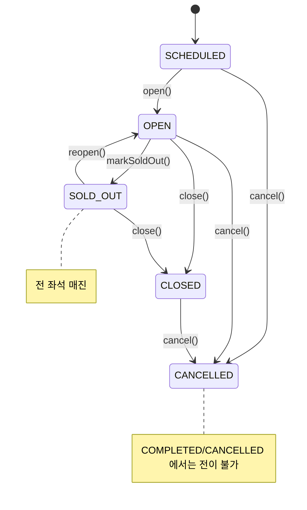
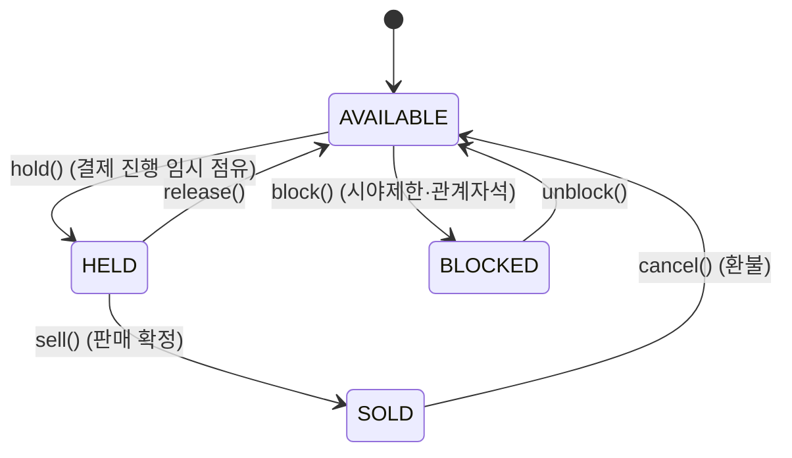
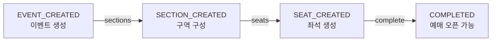
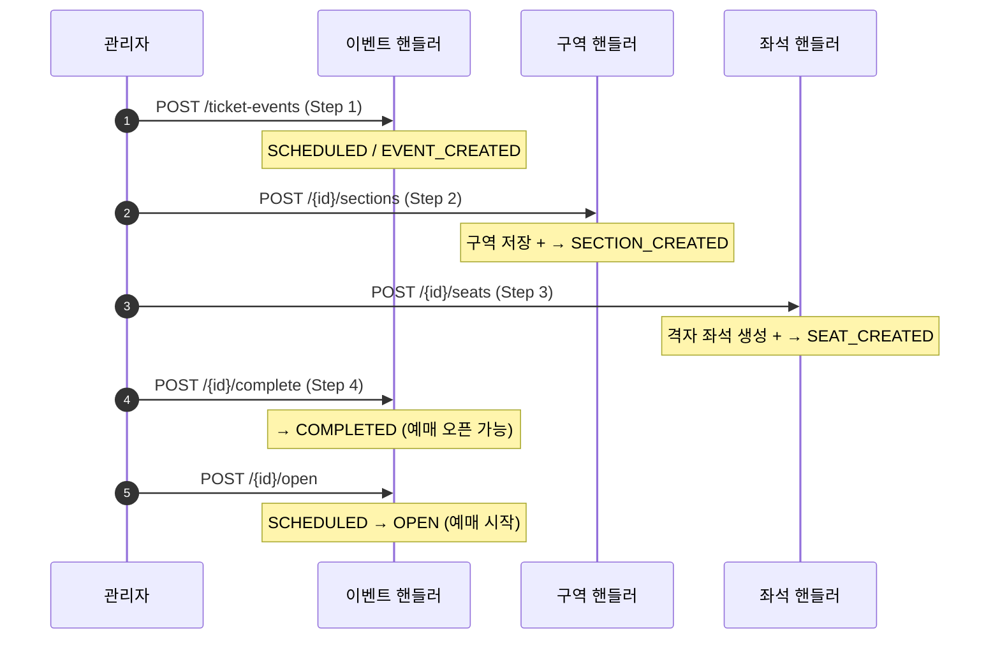

# 🎫 ticket-event-service — 티켓 이벤트

> `ticket-event-service` · 포트 **18082** · 상태 **✅ 구현됨**
> 공연/경기 같은 티켓 이벤트의 CRUD, 셋업 워크플로우(구역→좌석→완료), 상태 전이, 좌석 상태·잔여석 조회.

> [!info] 보안 의존성 없음
> 이 서비스는 자체 인증이 없습니다. 게이트웨이가 검증·주입한 `X-User-*` 헤더를 신뢰합니다.
> 조회(GET)는 비로그인도 허용되지만, 생성/수정 등 변경은 게이트웨이에서 인증을 요구합니다.
> ([architecture.md](./architecture.md#게이트웨이의-보장) 참고)

---

## 1. 한눈에 보기

티켓 이벤트는 **두 개의 독립된 상태축**을 가집니다.

- **셋업 진행도**(`TicketCreationStatus`) — 이벤트를 예매 가능 상태로 만들기까지의 4단계 파이프라인.
- **예매 상태**(`TicketEventStatus`) — 예매 오픈/마감/매진/취소 등 운영 생명주기.

| 항목 | 내용 |
|------|------|
| 집계 루트 | `TicketEventModel` (이벤트) → `Section`(구역) → `Seat`(좌석) |
| 인프라 | PostgreSQL (3 테이블) |
| 핵심 쿼리 | 상태별 좌석 집계(잔여석/매진 판정) |

### 엔드포인트 요약

| 분류 | 메서드·경로 | 설명 |
|------|------------|------|
| 명령 | `POST /api/ticket-events` | 이벤트 생성 (Step 1) |
| 명령 | `PUT /api/ticket-events/{id}` | 이벤트 수정 |
| 명령 | `POST /api/ticket-events/{id}/sections` | 구역 생성 (Step 2) |
| 명령 | `POST /api/ticket-events/{id}/seats` | 좌석 생성 (Step 3) |
| 명령 | `POST /api/ticket-events/{id}/complete` | 셋업 완료 (Step 4) |
| 명령 | `POST /api/ticket-events/{id}/open`·`/close`·`/cancel` | 예매 상태 전이 |
| 조회 | `GET /api/ticket-events`·`/{id}` | 목록(필터)·단건 |
| 조회 | `GET .../{eventId}/sections`·`/sections/{id}` | 구역 목록·단건 |
| 조회 | `GET .../{eventId}/seats`·`/seats/{id}` | 좌석 목록·단건 |
| 조회 | `GET .../{eventId}/seats/availability` | 좌석 잔여 현황(상태별 집계) |

---

## 2. 도메인 모델

### TicketEventModel (집계 루트)

| 필드 | 타입 | 비고 |
|------|------|------|
| `id` | `Long?` | |
| `ticketEventName` | `String` | not blank |
| `ticketOpenAt` | `Instant` | 예매 오픈 시각 |
| `ticketClosedAt` | `Instant` | **> `ticketOpenAt`** |
| `ticketEventAt` | `Instant` | 실제 이벤트 시각, **≥ `ticketClosedAt`** |
| `ticketEventStatus` | `TicketEventStatus` | 기본 `SCHEDULED` |
| `ticketCreationStatus` | `TicketCreationStatus` | 기본 `EVENT_CREATED` |
| `ticketEventCategory` | `TicketEventCategory` | |
| `createdAt` / `updatedAt` | `Instant?` | |

상태 전이 메서드(불변 — 새 인스턴스 반환): `open()`, `close()`, `markSoldOut()`, `reopen()`,
`cancel()`, `markSectionsCreated()`, `markSeatsCreated()`, `completeCreation()`.
판단 메서드: `isBookable(at)`, `isCreationCompleted()`.

### TicketEventSectionModel (구역)

| 필드 | 타입 | 제약 |
|------|------|------|
| `id` | `Long?` | |
| `ticketEventId` | `Long` | 소속 이벤트 |
| `sectionName` | `String` | not blank (예: "VIP석") |
| `grade` | `String` | not blank (예: "VIP", "R") |
| `price` | `Long` | ≥ 0 |
| `capacity` | `Int` | ≥ 1, 구역 전체 좌석 수 |
| `seatsPerRow` | `Int` | ≥ 1, 기본 20 — **좌석 그리드 한 줄 길이** |

### TicketEventSeatModel (좌석)

| 필드 | 타입 | 비고 |
|------|------|------|
| `id` | `Long?` | |
| `sectionId` | `Long` | 소속 구역 |
| `ticketEventId` | `Long` | 비정규화(이벤트 단위 조회/파티셔닝용), 생성 후 불변 |
| `rowLabel` | `String` | 행 표기 `A`,`B`…`Z`,`AA`… (bijective base-26) |
| `seatNumber` | `Int` | 행 내 좌석 번호 (≥ 1) |
| `status` | `SeatStatus` | 기본 `AVAILABLE` |

좌석 전이 메서드: `hold()`, `release()`, `sell()`, `cancel()`, `block()`, `unblock()`.

### Enum

| Enum | 값 |
|------|-----|
| `TicketEventStatus` | `SCHEDULED` · `OPEN` · `CLOSED` · `SOLD_OUT` · `CANCELLED` · `COMPLETED` |
| `TicketCreationStatus` | `EVENT_CREATED` → `SECTION_CREATED` → `SEAT_CREATED` → `COMPLETED` (순방향) |
| `SeatStatus` | `AVAILABLE` · `HELD` · `SOLD` · `BLOCKED` |
| `TicketEventCategory` | `CONCERT` · `MUSICAL` · `PLAY` · `SPORTS` · `EXHIBITION` · `FESTIVAL` · `ETC` |

### 예외 (`TicketEventException`, sealed)

| 예외 | HTTP |
|------|:----:|
| `TicketEventNotFound` · `SectionNotFound` · `SeatNotFound` | 404 |
| `InvalidStatusTransition(reason)` · `InvalidSeatStatusTransition(reason)` | 409 |

---

## 3. 상태 머신

### 예매 상태 (`TicketEventStatus`)



### 좌석 상태 (`SeatStatus`)



### 셋업 진행도 (`TicketCreationStatus`)



---

## 4. 유스케이스

도메인이 이벤트/구역/좌석 셋으로 나뉘므로, 핸들러도 관심사별로 분리됩니다. 모든 명령은
`@Transactional`, 조회는 `@Transactional(readOnly = true)`.

### 명령 핸들러

| 핸들러 | 구현 유스케이스 | 함수 |
|--------|----------------|------|
| `TicketEventCommandHandler` | Create/Update/Open/Close/Cancel/CompleteCreation | `create`·`update`·`open`·`close`·`cancel`·`complete` |
| `TicketEventSectionCommandHandler` | `CreateSectionsUseCase` | `createSections(cmd): SectionCreationResult` |
| `TicketEventSeatCommandHandler` | `CreateSeatsUseCase` | `createSeats(cmd): SeatCreationResult` |

- 구역 생성 핸들러는 구역 저장 **+ 이벤트를 `EVENT_CREATED → SECTION_CREATED`** 로 같은 트랜잭션에서 전이.
- 좌석 생성 핸들러는 좌석 격자 생성 **+ `SECTION_CREATED → SEAT_CREATED`** 전이.

### 조회 핸들러

| 핸들러 | 구현 유스케이스 |
|--------|----------------|
| `TicketEventQueryHandler` | `GetTicketEventUseCase`, `SearchTicketEventsUseCase`(category/status 필터) |
| `TicketEventSectionQueryHandler` | `GetSectionUseCase`(소속 검증), `ListSectionsByEventUseCase` |
| `TicketEventSeatQueryHandler` | `GetSeatUseCase`(소속 검증), `ListSeatsByEventUseCase`, `GetSeatAvailabilityUseCase` |

> `getById` 계열은 경로의 `eventId` 와 대상의 `ticketEventId` 일치를 검증해, 다른 이벤트의
> 구역/좌석을 우회 조회하지 못하게 합니다.

### 아웃바운드 포트

| 포트 | 주요 메서드 |
|------|------------|
| `TicketEventPersistencePort` | `save` · `findById` · `existsById` · `search(category?, status?)` |
| `TicketEventSectionPersistencePort` | `saveAll` · `findById` · `findByTicketEventId` |
| `TicketEventSeatPersistencePort` | `saveAll` · `findById` · `findByTicketEventId` · `existsByTicketEventIdAndStatus` · `countByTicketEventIdGroupedByStatus` |

---

## 5. API 레퍼런스

모든 변경 엔드포인트는 시간 불변식(`ticketClosedAt > ticketOpenAt`, `ticketEventAt ≥ ticketClosedAt`)을
위반하면 **400**, 허용되지 않는 상태 전이는 **409**, 대상 없음은 **404** 를 반환합니다.

### POST `/api/ticket-events` — 이벤트 생성 (Step 1)

요청 `CreateTicketEventRequest`
```json
{ "ticketEventName": "2026 콘서트", "ticketOpenAt": "2026-02-01T10:00:00Z",
  "ticketClosedAt": "2026-02-10T23:59:59Z", "ticketEventAt": "2026-03-01T19:00:00Z",
  "ticketEventCategory": "CONCERT" }
```
응답 **201** `TicketEventResponse` (status=`SCHEDULED`, creationStatus=`EVENT_CREATED`)

### PUT `/api/ticket-events/{id}` — 수정 → **200**

### POST `/api/ticket-events/{id}/sections` — 구역 생성 (Step 2)

요청 `CreateSectionsRequest`
```json
{ "sections": [
  { "sectionName": "VIP석", "grade": "VIP", "price": 150000, "capacity": 100, "seatsPerRow": 20 }
] }
```
- `sections` `@NotEmpty` · 각 항목: name `@Size(max=100)`, grade `@Size(max=30)`,
  price `@PositiveOrZero`, capacity `@Min(1)`, seatsPerRow `@Min(1)` 기본 20

응답 **201** `SectionCreationResponse` `{ ticketEvent, sections[] }`

### POST `/api/ticket-events/{id}/seats` — 좌석 생성 (Step 3)

본문 없음. 모든 구역의 `capacity` 만큼 좌석을 격자로 생성.
응답 **201** `SeatCreationResponse` `{ ticketEvent, createdSeatCount }`

### POST `/api/ticket-events/{id}/complete` — 셋업 완료 (Step 4) → **200**

`SEAT_CREATED → COMPLETED`. 이후 `open()` 으로 예매 오픈 가능.

### 예매 상태 전이 → **200**

| 경로 | 전이 |
|------|------|
| `POST .../{id}/open` | `SCHEDULED → OPEN` |
| `POST .../{id}/close` | `OPEN → CLOSED` |
| `POST .../{id}/cancel` | `→ CANCELLED` |

### 조회

| 경로 | 응답 |
|------|------|
| `GET /api/ticket-events?category=&status=` | `List<TicketEventResponse>` |
| `GET /api/ticket-events/{id}` | `TicketEventResponse` |
| `GET .../{eventId}/sections` · `/sections/{sectionId}` | 구역 목록 · 단건 |
| `GET .../{eventId}/seats` · `/seats/{seatId}` | 좌석 목록 · 단건 |
| `GET .../{eventId}/seats/availability` | `SeatAvailabilityResponse` |

`SeatAvailabilityResponse`
```json
{ "ticketEventId": 1, "counts": { "AVAILABLE": 80, "HELD": 5, "SOLD": 15, "BLOCKED": 0 },
  "total": 100, "available": 80 }
```
> `counts` 는 4개 상태 키를 항상 포함합니다(없으면 0).

---

## 6. 영속성 & 주요 알고리즘

### 테이블

| 테이블 | 인덱스 | 비고 |
|--------|--------|------|
| `ticket_events` | — | 상태/카테고리 enum→VARCHAR(20) |
| `ticket_event_sections` | `idx_section_event(ticketEventId)` | `seatsPerRow` 는 nullable(레거시 호환, 매핑 시 기본 20) |
| `ticket_event_seats` | `idx_seat_event_status(ticketEventId, status)`, `idx_seat_section(sectionId)` | 핫 쿼리(잔여석·매진)용 복합 인덱스 |

### 상태별 좌석 집계 (잔여석/매진의 단일 진실원천)

`countByTicketEventIdGroupedByStatus` 가 다음 JPQL 로 한 번에 집계합니다.

```sql
SELECT s.status, COUNT(s) FROM TicketEventSeatEntity s
WHERE s.ticketEventId = :id GROUP BY s.status
```

- **잔여석** = `counts[AVAILABLE]`, **총석** = 전체 합.
- **매진 판정**은 `existsByTicketEventIdAndStatus(id, AVAILABLE)` 로 저렴하게 확인(존재하면 잔여 있음).
  마지막 좌석 판매 시 `OPEN → SOLD_OUT` 전이로 연결(서비스 간 조정은 예매 도메인에서 발생).

### 격자 좌석 생성 (`rowLabel`)

좌석은 `(0..capacity-1)` 인덱스를 `seatsPerRow` 로 나눠 행/열로 배치합니다.

- 행 = `index / seatsPerRow` → **bijective base-26** 라벨: 0→`A`, 25→`Z`, 26→`AA`, 51→`AZ`, 52→`BA` …
- 열 = `index % seatsPerRow + 1` → 좌석 번호(1..seatsPerRow)

예) `capacity=100, seatsPerRow=20` → 5행(A~E) × 20석 → `A1..A20, B1..B20, … E1..E20`.
모든 좌석은 `AVAILABLE` 로 시작합니다.

---

## 7. 셋업 워크플로우 (전체)


