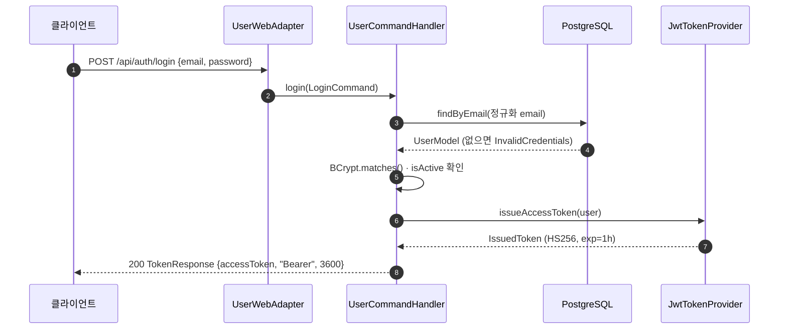
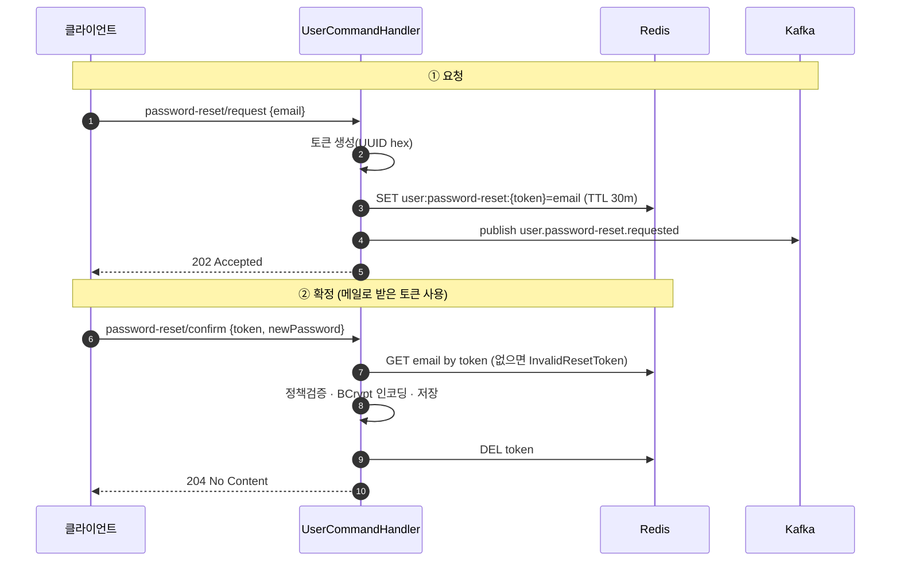

# 👤 user-service — 사용자 / 인증

> `user-service` · 포트 **18081** · 상태 **✅ 구현됨**
> 회원가입 · 로그인(JWT 발급) · 비밀번호 재설정 · 내 정보 조회를 담당하는 인증 도메인.

JWT 를 **발급**하는 서비스입니다(검증은 게이트웨이 + 자체 필터). 시스템 전체 인증 구조는
[architecture.md](./architecture.md#2-인증-아키텍처-핵심) 참고.

---

## 1. 한눈에 보기

| 항목 | 내용 |
|------|------|
| 책임 | 사용자 계정 생명주기 + 인증 토큰 발급 |
| 부가 인프라 | PostgreSQL(`users`), Redis(재설정 토큰), Kafka(이벤트 발행) |
| 보안 | 자체 `SecurityConfig` + `JwtAuthenticationFilter` (Stateless, BCrypt) |

### 주요 엔드포인트

| 메서드 | 경로 | 설명 | 인증 |
|:------:|------|------|:----:|
| POST | `/api/auth/register` | 회원가입 | 공개 |
| POST | `/api/auth/login` | 로그인(JWT 발급) | 공개 |
| POST | `/api/auth/password-reset/request` | 비밀번호 재설정 요청 | 공개 |
| POST | `/api/auth/password-reset/confirm` | 비밀번호 재설정 확정 | 공개 |
| GET | `/api/users/me` | 내 정보 조회 | 🔒 Bearer |

---

## 2. 도메인 모델

### UserModel

순수 Kotlin 불변 모델. 비밀번호는 **항상 인코딩된 값**만 보관합니다(평문 금지).

| 필드 | 타입 | 비고 |
|------|------|------|
| `id` | `Long?` | 신규는 null |
| `email` | `String` | 정규화(trim+소문자)된 이메일 |
| `encodedPassword` | `String` | BCrypt 해시 |
| `name` | `String` | |
| `role` | `UserRole` | 기본 `USER` |
| `status` | `UserStatus` | 기본 `ACTIVE` |
| `createdAt` / `updatedAt` | `Instant?` | |

- `isActive: Boolean` — `status == ACTIVE`
- `withPassword(newEncodedPassword): UserModel` — 비밀번호만 교체한 복사본

### Enum

| Enum | 값 |
|------|-----|
| `UserRole` | `USER`, `ADMIN` |
| `UserStatus` | `ACTIVE`, `INACTIVE`, `LOCKED` |

### 도메인 서비스 — `UserDomainService`

상태 없는 순수 서비스(Spring 빈 아님). 생성·검증 규칙을 담습니다.

- `createUser(email, encodedPassword, name, role)` — 이메일 정규화 + 형식 검증 + 이름 trim 후 모델 생성
- `normalizeEmail(email)` — trim → 소문자
- `validateEmailFormat(email)` — 정규식 `^[A-Za-z0-9+_.-]+@[A-Za-z0-9.-]+\.[A-Za-z]{2,}$`
- `validatePasswordPolicy(rawPassword)` — **8자 이상 + 숫자 1개 이상 + 영문 1개 이상**

### 예외 (`UserException`, sealed)

| 예외 | HTTP | 메시지 |
|------|:----:|--------|
| `EmailAlreadyExists` | 409 | 이미 사용 중인 이메일입니다 |
| `UserNotFound` | 404 | 사용자를 찾을 수 없습니다 |
| `InvalidCredentials` | 401 | 이메일 또는 비밀번호가 올바르지 않습니다 |
| `InactiveUser` | 403 | 사용할 수 없는 계정입니다 |
| `InvalidEmail` | 400 | 올바른 이메일 형식이 아닙니다 |
| `InvalidPassword(reason)` | 400 | (정책 위반 사유) |
| `InvalidResetToken` | 400 | 유효하지 않거나 만료된 재설정 토큰입니다 |

---

## 3. 유스케이스

CQRS 로 명령/조회를 분리합니다. 핸들러는 같은 그룹의 단일함수 인터페이스들을 함께 구현합니다.

### 명령 — `UserCommandHandler` (`@Service @Transactional`)

| 유스케이스 | 함수 | 동작 요약 |
|-----------|------|----------|
| `RegisterUserUseCase` | `register(cmd): UserResult` | 이메일 중복확인 → 정책검증 → BCrypt 인코딩 → 저장 → `user.registered` 발행 |
| `LoginUseCase` | `login(cmd): TokenResult` | 이메일 조회 → BCrypt 매칭 → 활성확인 → JWT 발급 |
| `RequestPasswordResetUseCase` | `requestPasswordReset(cmd)` | 토큰 생성 → Redis 저장(30분) → `user.password-reset.requested` 발행 |
| `ResetPasswordUseCase` | `resetPassword(cmd)` | Redis 토큰 검증 → 정책검증 → 비밀번호 교체 → 토큰 삭제 |

### 조회 — `UserQueryHandler` (`@Service @Transactional(readOnly = true)`)

| 유스케이스 | 함수 | 동작 |
|-----------|------|------|
| `GetUserUseCase` | `getById(query): UserResult` | ID 로 조회, 없으면 `UserNotFound` |

### 아웃바운드 포트 (`port.out`)

| 포트 | 관심사 | 구현체 |
|------|--------|--------|
| `UserPersistencePort` | DB | `UserPersistenceAdapter` (JPA) |
| `UserTokenPort` | JWT 발급/검증 | `JwtTokenProvider` |
| `UserMemoryPort` | Redis (재설정 토큰 TTL) | `UserMemoryAdapter` |
| `UserMessagePort` | Kafka 이벤트 발행 | `UserMessageAdapter` |

---

## 4. API 레퍼런스

기본 검증 실패(`@Valid`)는 모두 **400** + `fieldErrors`. 공통 에러 형식은
[architecture.md](./architecture.md#에러-응답-형식-전-서비스-공통) 참고.

### POST `/api/auth/register` — 회원가입

요청 `RegisterRequest`
```json
{ "email": "user@example.com", "password": "pass1234", "name": "홍길동" }
```
- `email` `@Email @NotBlank` · `password` `@Size(8..64) @NotBlank` · `name` `@Size(max=50) @NotBlank`

응답 **201** `UserResponse`
```json
{ "id": 1, "email": "user@example.com", "name": "홍길동",
  "role": "USER", "status": "ACTIVE", "createdAt": "2026-01-01T00:00:00Z" }
```
- **400** 정책 위반 · **409** 이메일 중복

### POST `/api/auth/login` — 로그인

요청 `LoginRequest` `{ "email", "password" }`

응답 **200** `TokenResponse`
```json
{ "accessToken": "eyJhbGciOiJIUzI1NiJ9...", "tokenType": "Bearer", "expiresIn": 3600 }
```
- **401** 이메일/비밀번호 불일치 · **403** 비활성 계정

### POST `/api/auth/password-reset/request` — 재설정 요청

요청 `{ "email" }` → 응답 **202 Accepted** (본문 없음)

> 계정 존재 여부를 노출하지 않기 위해, 가입되지 않은 이메일이어도 **202** 를 반환합니다.
> 토큰은 Kafka(`user.password-reset.requested`)를 구독하는 메일 발송 측에서 전달합니다.

### POST `/api/auth/password-reset/confirm` — 재설정 확정

요청 `{ "token", "newPassword" }` (`newPassword` `@Size(8..64)`)

응답 **204 No Content** · **400** 토큰 무효/만료 또는 정책 위반

### GET `/api/users/me` — 내 정보 🔒

`Authorization: Bearer <JWT>` 필요. 응답 **200** `UserResponse` · **401** 토큰 누락/무효.

---

## 5. 영속성 & 인프라

### 테이블 `users` (`UserEntity`)

| 컬럼 | 타입 | 제약 |
|------|------|------|
| `id` | BIGINT | PK, IDENTITY |
| `email` | VARCHAR | **UNIQUE**, NOT NULL |
| `password` | VARCHAR | NOT NULL (BCrypt) |
| `name` | VARCHAR | NOT NULL |
| `role` | VARCHAR(20) | enum→STRING |
| `status` | VARCHAR(20) | enum→STRING |
| `createdAt` | TIMESTAMP | `@CreationTimestamp`, updatable=false |
| `updatedAt` | TIMESTAMP | `@UpdateTimestamp` |

`UserPersistenceRepository` : `findByEmail`, `existsByEmail`.

### Redis (`UserMemoryAdapter`)

| 키 패턴 | 값 | TTL |
|---------|-----|-----|
| `user:password-reset:{token}` | email | 30분 |

토큰은 `UUID` 에서 하이픈을 제거한 32자 hex.

### Kafka (`UserMessageAdapter`)

| 토픽 | 키 | 페이로드 | 시점 |
|------|-----|----------|------|
| `user.registered` | userId | email | 회원가입 성공 시 |
| `user.password-reset.requested` | email | resetToken | 재설정 요청 시 |

> 발행은 best-effort — 실패해도 로깅만 하고 본 흐름을 막지 않습니다.

### JWT (`JwtTokenProvider`, `UserTokenPort` 구현)

HS256, 비밀키는 `jwt.secret`(≥32 byte). 클레임 `iss`/`sub`/`email`/`role`/`iat`/`exp`.
만료 기본 1시간. 토큰 사양 전체는 [architecture.md](./architecture.md#jwt-토큰-사양) 참고.

### 보안 설정 (게이트웨이 우회 직접 호출 대비)

`SecurityConfig` — CSRF/HTTP Basic/Form Login 비활성, **Stateless** 세션, `BCryptPasswordEncoder` 빈.
공개 경로: `/api/auth/**`, `/actuator/**`, `/swagger-ui/**`, `/v3/api-docs/**`.

`JwtAuthenticationFilter`(`OncePerRequestFilter`) — `Authorization: Bearer` 를 `UserTokenPort` 로
검증해 `AuthenticatedUser(userId, email, role)` 를 `SecurityContext` 에 세팅. 컨트롤러는
`@AuthenticationPrincipal` 로 주입받습니다.

> 게이트웨이는 `X-User-*` 헤더로 신원을 전달하지만, user-service 는 추가로 **자체 토큰 검증**도 하므로
> 게이트웨이를 우회한 직접 호출에서도 인증이 걸립니다.

---

## 6. 주요 흐름

### 로그인 (JWT 발급)



### 비밀번호 재설정 (2단계)


